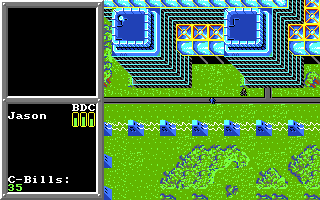
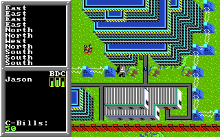
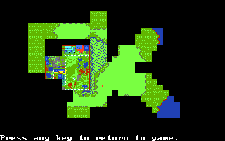

# Map Extraction Tools for BattleTech: The Crescent Hawk's Inception

Back in 1988 I played a game called [BattleTech: The Crescent Hawk's Inception](https://en.wikipedia.org/wiki/BattleTech:_The_Crescent_Hawk%27s_Inception)
on my Commodore 64 and then on an MS-DOS 80286. It was a fun game because there
was a huge universe to explore. The game included a paper map with a rough
layout of the planet, and there was an inbuilt map that revealed the world
as you walked through it, but I always wanted to view the entire planet in
high-resolution.

24 years later I was thinking about trying to build a visualization tool that
could render the entire BattleTech universe on a modern computer. It could also
be interesting to fly over the surface of it in a flight simulator. So I started
reverse engineering the original MS-DOS 8086 BTECH.EXE to see how it worked. I created
various tools that can modify save games to give you unlimited money, move
the character around the planet, and render the layout of each town. I also
created visualizations to inspect the DosBox emulator memory of the game to
see what the data structures looked like internally, but found no map. The
entire planet is actually procedurally generated, and does not exist even in
memory when the game is running inside DosBox. Instead, as you move the character,
the game calculates what that part of the world looks like (grassland, water, rocks),
and then generates tiles for it based on an image atlas, and then renders it to
the frame buffer. But the map does not exist as a nice array of tiles anywhere.
So if you cannot get a map inspecting the memory, how can we view it outside the game?

I have built a specially modified version of [DosBox](https://github.com/waynepiekarski/fs4-dosbox)
that I used previously for modifying [Flight Simulator 4](https://www.waynepiekarski.net/blog/2017/06/immersive-flight-sim-4.htm) to run on multiple monitors.
This modified version includes the ability to control the BTECH.EXE game inside
DosBox, move the character around, and capture screenshots along a grid. The
screenshots are cropped to remove the game artwork and saved with the capture coordinates.

The BTECH.EXE has been patched into MAPWALK.EXE, which removes the character
artwork to keep it out of the screenshots, prevents building and water collisions,
and allows DosBox to inject keyboard arrow keys to move the character uninterrupted.
The game is now under full control of the modified DosBox.

The modified DosBox starts from the northwest corner, moving the character from west to east across a map,
monitoring the memory location for the coordinates. When the character reaches
the east edge, it travels one unit south, then travels west to east. You keep
sweeping back and forth until you hit the bottom corner. This takes a few hours
and there are glitches in the game so you need to do restart the run until you
get a complete capture of all locations. The stitching tool then builds up a 16384x16384
internal memory array, and loads each screenshot into the correct location. It checks
that overlapping pixels are aligned correctly, and any holes in the final output are emitted
as coordinates to be retried until the image is complete. The final image is then
saved as an 8-bit PNG with compression which you can view here.

# 16384x16384 Universe

The final result is a 16384x16384 8-bit image that consumes 256 MB of memory,
and at least 768 MB of memory to actually render as RGB. But once loaded,
you can zoom and move freely through the image. Zoom in enough and you can
see the game as it looked at 320x200 on the old MS-DOS machine.

(this preview is scaled in the browser and may take time to render, download it locally for full detail)

# Low-Res Map Preview

The game also included a map preview at low resolution, which was concealed
from the player until you have walked everywhere in the map. After patching the
savegame to reveal the entire map, I capture screenshots and stitched these maps
together to produce a single image at 1032x960.

Before this project, the best map preview was this grainy 492x575 GIF from <a href="https://www.sarna.net/wiki/File:Chara_III_Planetary_Map.gif">sarna.net</a>.

# mtp2png Decoder

The game includes MTP files that define each town you can visit. These images
are the result of the MTP2PNG conversion tool that decodes and renders them.
 

# hacks/addmoney

Modifies save game files to give the character the maximum amount of money.

# hacks/movexy

Modifies save game files to move the character to any location in the planet.

# hacks/show-map-savegame.sh

Modifies save game files to remove the fog and reveal the entire map preview.

# License

Map Extraction Tools for BattleTech: The Crescent Hawk's Inception

Copyright (C) 2022-2024 Wayne Piekarski
wayne@tinmith.net http://tinmith.net/wayne

This program is free software: you can redistribute it and/or modify
it under the terms of the GNU General Public License as published by
the Free Software Foundation, either version 3 of the License, or
(at your option) any later version.

This program is distributed in the hope that it will be useful,
but WITHOUT ANY WARRANTY; without even the implied warranty of
MERCHANTABILITY or FITNESS FOR A PARTICULAR PURPOSE.  See the
GNU General Public License for more details.

You should have received a copy of the GNU General Public License
along with this program.  If not, see <http://www.gnu.org/licenses/>.
