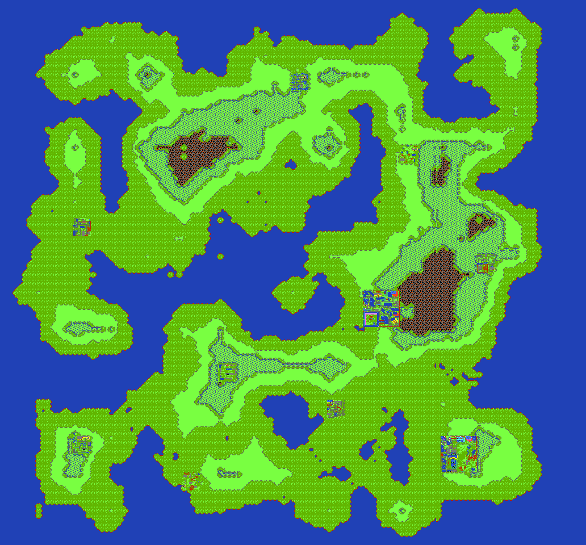
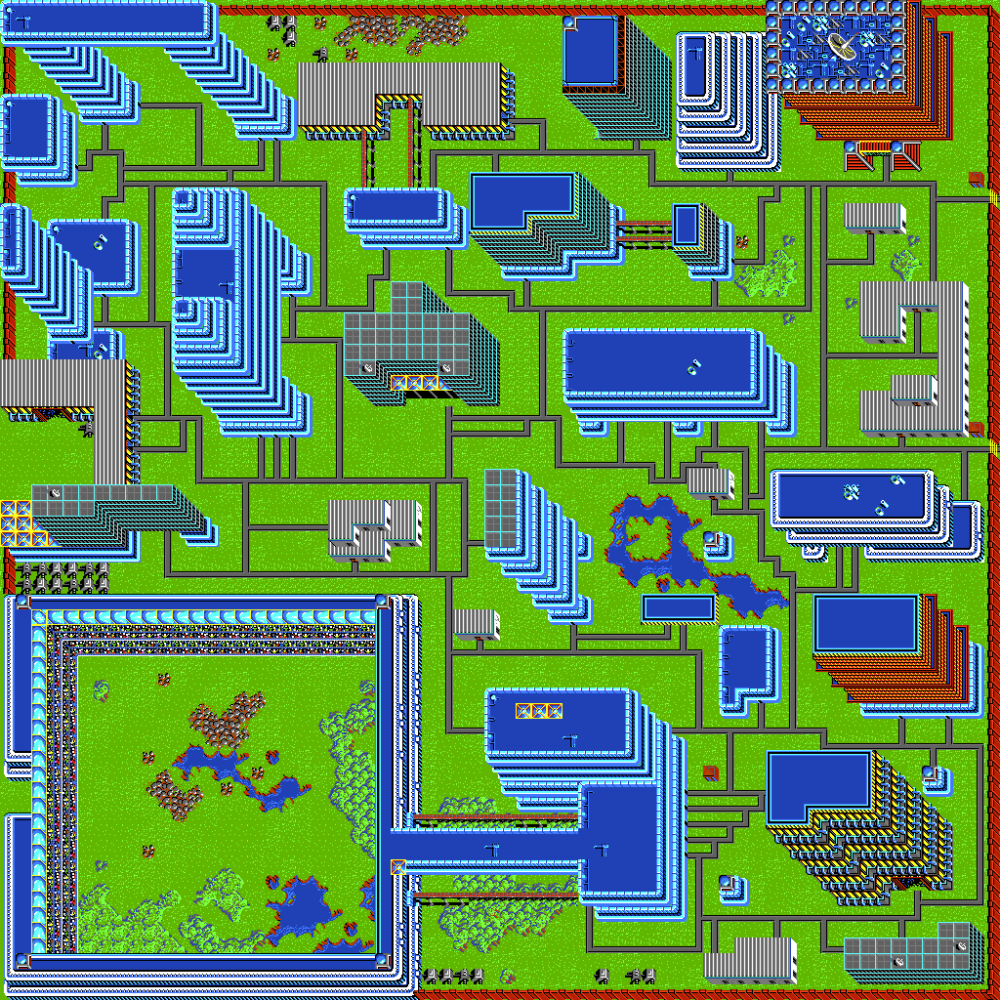
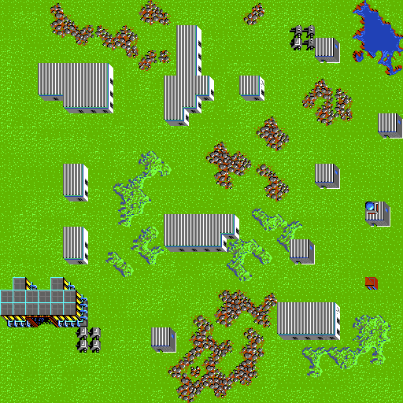
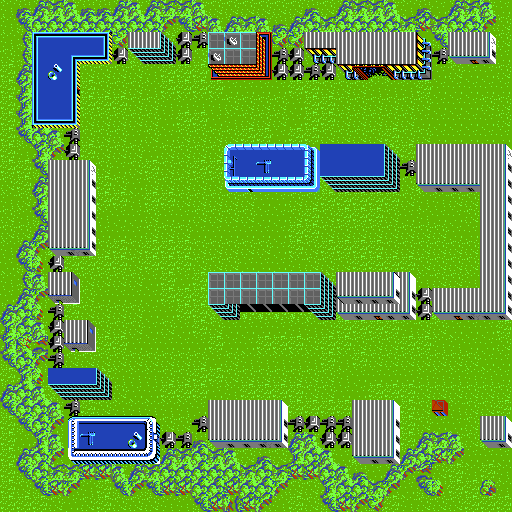
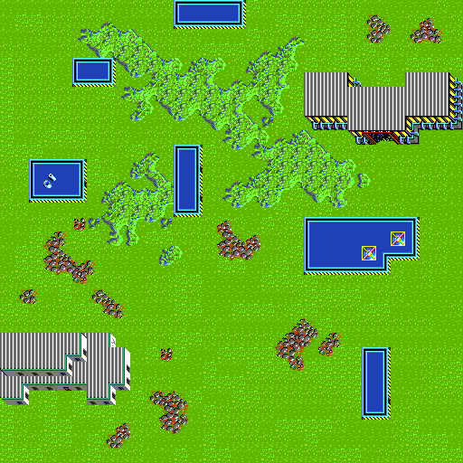
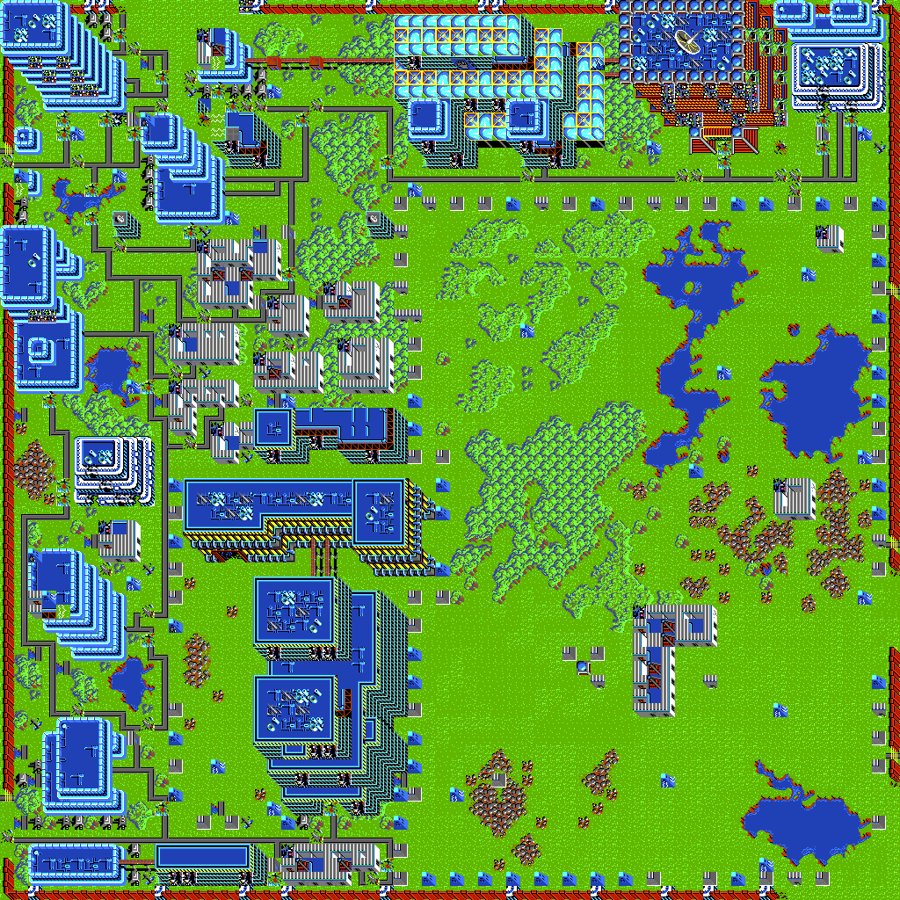

# Map Extraction Tools and for BattleTech: The Crescent Hawk's Inception

Back in 1988 I played a game called [BattleTech: The Crescent Hawk's Inception](https://en.wikipedia.org/wiki/BattleTech:_The_Crescent_Hawk%27s_Inception)
on my Commodore 64 and then on an MS-DOS 80286. It was a fun game because there
was a huge universe to explore. The game included a paper map with a rough
layout of the planet, and there was an inbuilt map that revealed the world
as you walked through it, but I always wanted to view the entire planet in
high-resolution.

24 years later I was thinking about trying to build a visualization tool that
could render the entire BattleTech universe on a modern computer. I created
various tools that can modify save games to give you unlimited money, move
the character around the planet, and render the layout of each town. But the
entire planet is actually procedurally generated, and does not exist even in
memory when the game is running inside DosBox. Instead, as you move the character,
the game calculates the map view for that frame and then renders it. But you
cannot see the map by inspecting the memory. So how can we view it then?

I have built a specially modified version of [DosBox](https://github.com/waynepiekarski/fs4-dosbox)
that I used previously for modifying [Flight Simulator 4](https://www.waynepiekarski.net/blog/2017/06/immersive-flight-sim-4.htm) to run on multiple monitors.
This modified version includes the ability to control the BTECH.EXE game inside
DosBox, move the character around, and capture screenshots along a grid. The
screenshots are cropped to remove game artwork and saved to disk as tiles, and then a stitching algorithm is
run over the screenshots to combine them into one big map of the entire game universe.

The BTECH.EXE has been patched into MAPWALK.EXE, which removes the character
artwork, prevents building and water collisions, and allows DosBox to inject
keyboard arrow keys to move the character uninterrupted.

# 16384x16384 Universe

The final result is a 16384x16384 8-bit image that consumes 256 MB of memory,
and at least 768 MB of memory to actually render as RGB. But once loaded,
you can zoom and move freely through the image. Zoom in enough and you can
see the game as it looked at 320x200 on the old MS-DOS machine.

[Universe 16384x16384](./universe/universe-all.png)

# Map

The game also included a map preview at low resolution. I also stitched these
maps together to produce a single image.

# mtp2png Decoder

The game includes MTP files that define each town you can visit. These images
are the result of the MTP2PNG conversion tool that decodes and renders them.

# hacks/addmoney

Modifies save game files to give the character the maximum amount of money.

# hacks/movexy

Modifies save game files to move the character to any location in the planet.

# hacks/show-map-savegame.sh

Modifies save game files to remove the fog and reveal the entire map preview.

# License

Map Extraction Tools for BattleTech: The Crescent Hawk's Inception

Copyright (C) 2022-2024 Wayne Piekarski
wayne@tinmith.net http://tinmith.net/wayne

This program is free software: you can redistribute it and/or modify
it under the terms of the GNU General Public License as published by
the Free Software Foundation, either version 3 of the License, or
(at your option) any later version.

This program is distributed in the hope that it will be useful,
but WITHOUT ANY WARRANTY; without even the implied warranty of
MERCHANTABILITY or FITNESS FOR A PARTICULAR PURPOSE.  See the
GNU General Public License for more details.

You should have received a copy of the GNU General Public License
along with this program.  If not, see <http://www.gnu.org/licenses/>.
